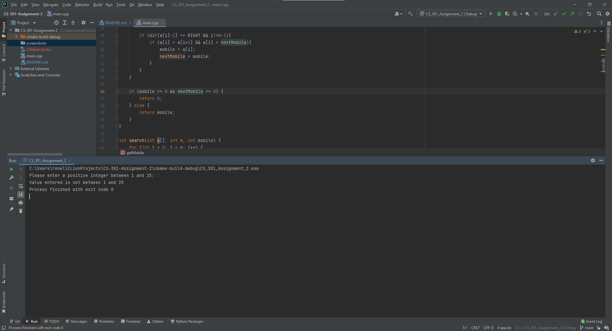
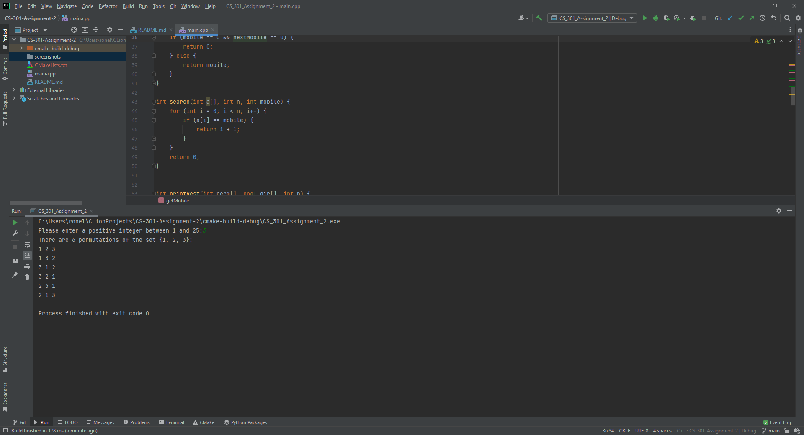

# CS 301 Assignment 2
Study Group 7 (Alex Milanez, John Edwin Karel Delgado, Ronell Sean Rulloda)

## Project Plan

## Test Plan
The Johnson and Trotter algorithm can be applied without needing to store every permutation of 
size n-1 or go through every shorter permutation. Instead, it records the orientation of each 
permutational component. As well as the permCount integer can be used to provide user input in 
order to calculate the permutations, as it will ask the user to enter a number.

| Reason for Test Case | Input Values |                                        Expected Output |
|---------------------:|-------------:|-------------------------------------------------------:|
| Check negative input |           -1 |                  Value entered is not between 1 and 25 |
|  Check input too big |           26 |                  Value entered is not between 1 and 25 |
|  Check correct input |            3 | Prints out number of permutations and all permutations |

## Functions planned to implement:
* johnsonTrotter(int n)
* printPerm(int n)
* printRest(int n)
* getMobile(int a[], bool dir[], int n)
* int search(int a[], int n, int mobile)
* count(int n)

## Output Screenshots
Check negative input

Check input too big

Check correct input
